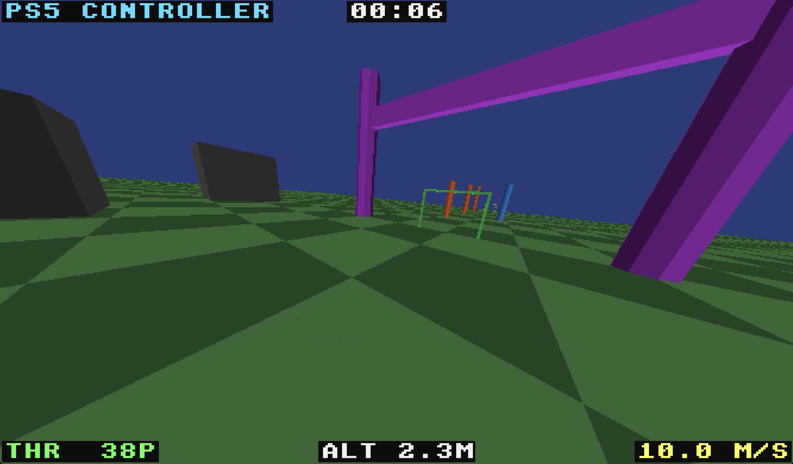

# fpv

A physics-based FPV drone simulator that runs in the terminal. Written in Rust.




## Features

- **Physics simulation** — quaternion-based orientation, Betaflight-style rate curves, linear drag, motor response modeling
- **Two render modes** — HalfBlock (unicode characters, works everywhere) and Kitty Graphics Protocol (real pixels, double-buffered)
- **Auto-detection** — automatically selects Kitty graphics when running in a supported terminal (Kitty, WezTerm, Ghostty)
- **Radio controller support** — plug in a RadioMaster TX16S/TX15 or any USB gamepad (PS5, Xbox) via `gilrs`
- **Axis mapping** — configurable gamepad axis assignments with invert toggle
- **Keyboard controls** — smoothed analog-style input from binary keys
- **Procedural courses** — randomly generated each time you play, with gates, pillars, walls, ramps, and obstacle clusters
- **Collision detection** — AABB-based obstacle collision with bounce/crash (gates are fly-through)
- **Bitmap HUD** — throttle, altitude, speed, flight timer, and render mode rendered as pixels into the framebuffer
- **Sky gradient and fog** — horizon-to-zenith sky gradient with linear distance-based fog
- **Near-plane clipping** — Sutherland-Hodgman triangle clipping for close-up rendering
- **Frustum culling** — bounding sphere culling skips off-screen meshes
- **Menu system** — play, axis mapping, and quit options rendered with bitmap font

## Controls

### Keyboard

| Key | Action |
|-----|--------|
| `W` / `S` | Throttle up / down |
| `A` / `D` | Yaw left / right |
| `I` / `K` | Pitch forward / back |
| `J` / `L` | Roll left / right |
| `R` | Reset after crash |
| `Tab` | Toggle render mode |
| `Q` / `Esc` | Back to menu / quit |

### Radio Controller / Gamepad

Plug in via USB. Default Mode 2 mapping:
- Left stick Y = throttle, X = yaw
- Right stick Y = pitch, X = roll

Axes can be remapped and inverted via the Axis Mapping screen in the menu.

## Build & Run

```sh
cargo run --release
```

## Render Modes

**HalfBlock** — uses `▀` characters with foreground/background colors. Works in any terminal with truecolor support.

**Kitty Graphics Protocol** — sends real pixel data to the terminal. Double-buffered for flicker-free rendering. Auto-selected when running in [Kitty](https://sw.kovidgoyal.net/kitty/), [WezTerm](https://wezfurlong.org/wezterm/), or [Ghostty](https://ghostty.org/). Reduce your terminal font size for higher resolution.

## Dependencies

- [ratatui](https://ratatui.rs/) + [crossterm](https://docs.rs/crossterm/) — terminal UI
- [nalgebra](https://nalgebra.org/) — linear algebra, quaternions, projections
- [gilrs](https://gitlab.com/gilrs-project/gilrs) — gamepad/joystick input
- [base64](https://docs.rs/base64/) — Kitty graphics protocol encoding
- [rand](https://docs.rs/rand/) — procedural course generation
